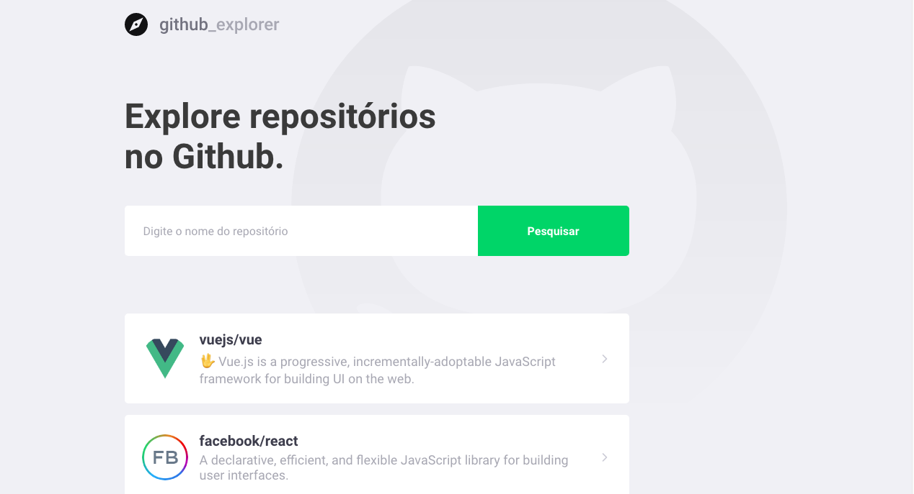
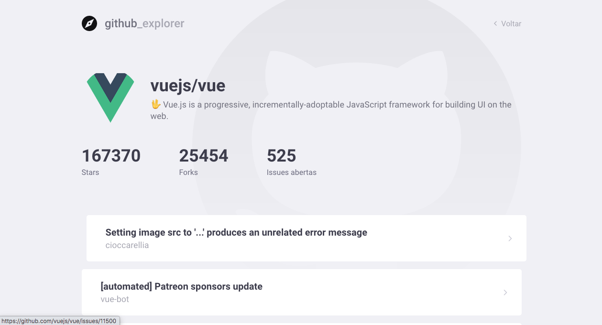
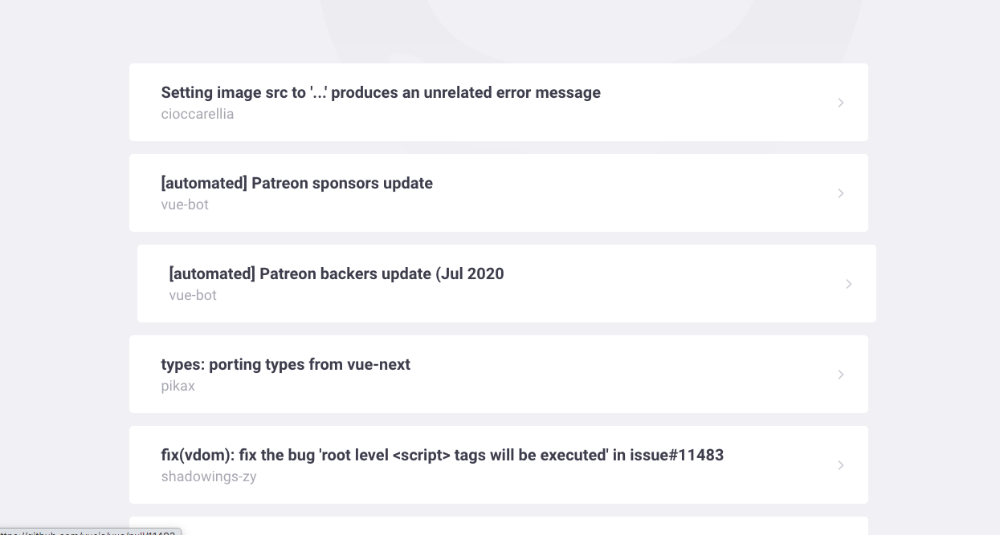

# 🚀 Github Explorer
TypeScript | ReactJS

At the conclusion of the first module of Level 03 of Bootcamp, I built this application using
TypeScript and ReactJS. Where I could review important concepts, on the front end using React, like states in the components,
properties, consumption of api's, routes, among others.

 
 
 

